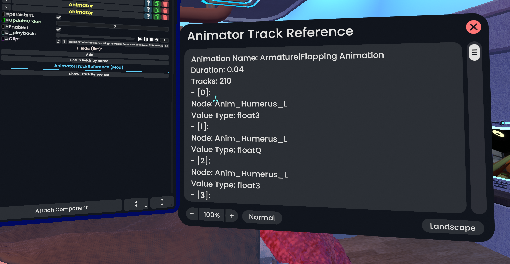

# AnimatorTrackReference

A [ResoniteModLoader](https://github.com/resonite-modding-group/ResoniteModLoader) mod for [Resonite](https://resonite.com/) that displays the available tracks in an `Animator` and their types. Requires the [MyInspectors](https://github.com/art0007i/MyInspectors) mod when not hosting worlds.

## Installation
1. Install [ResoniteModLoader](https://github.com/resonite-modding-group/ResoniteModLoader).
1. Place [AnimatorTrackReference.dll](https://github.com/Cyberboss/AnimatorTrackReference/releases/latest/download/AnimatorTrackReference.dll) into your `rml_mods` folder. This folder should be at `C:\Program Files (x86)\Steam\steamapps\common\Resonite\rml_mods` for a default Windows install. You can create it if it's missing, or if you launch the game once with ResoniteModLoader installed it will create this folder for you.
1. Start the game. If you want to verify that the mod is working you can check your Resonite logs.
